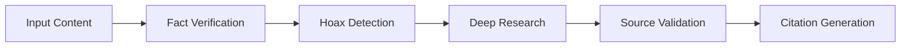
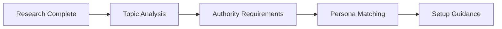
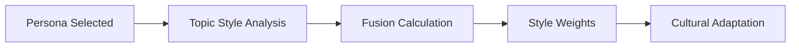
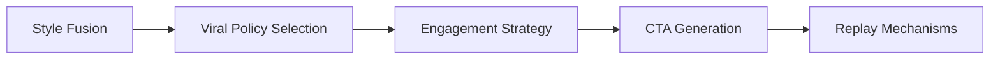

# INFLUENZIA_VIRALIST v3.9.1
## Advanced AI Content Generation System with RAG Architecture

### 📋 TABLE OF CONTENTS
1. [System Overview](#system-overview)
2. [Architecture Components](#architecture-components)
3. [RAG Module System](#rag-module-system)
4. [Processing Pipeline](#processing-pipeline)
5. [Content Generation Flow](#content-generation-flow)
6. [Advanced Features](#advanced-features)
7. [Implementation Guide](#implementation-guide)
8. [Development Guidelines](#development-guidelines)
9. [Troubleshooting](#troubleshooting)

---

## 📖 SYSTEM OVERVIEW

Influenzia v3.9.1 is a sophisticated AI-powered content generation system designed to create viral Indonesian video scripts with integrated fact-checking, deep research capabilities, and authentic creator persona modeling. The system generates 60-second video scripts optimized for platforms like TikTok, Instagram Reels, and YouTube Shorts.

### Key Capabilities:
- **Multi-source fact verification** with hoax detection
- **Deep research engine** with 3-12 source requirements
- **Smart creator persona recommendations** with visual setup guidance
- **Authentic style fusion** of Indonesian Gen-Z creators
- **Viral optimization engine** with replay trigger mechanisms
- **CINEGENIX format output** for video production compatibility

---

## 🏗️ ARCHITECTURE COMPONENTS

### Core Files Structure:
```
INFLUENZIA_VIRALIST/
├── Influenzia_3_9_1.md          # Main system prompt
├── README.md                    # This documentation
└── RAG/
    ├── rag_master_index.yaml    # Central configuration
    ├── CORE_PACK.yaml           # Core processing modules
    ├── STYLE_PACK.yaml          # Style fusion & personas
    ├── PERSONA_PACK.yaml        # Creator persona definitions
    ├── ENGAGEMENT_PACK.yaml     # Viral optimization & CTA
    └── RUNTIME_QUALITY.yaml     # Safety & quality controls
```

### System Dependencies:
- **Web search capability** (required for fact verification)
- **No external API calls** (security constraint)
- **Indonesian language processing** (primary output language)
- **CINEGENIX format compatibility** (video production pipeline)

---

## 🔧 RAG MODULE SYSTEM

### Module Mapping:
| Module | File | Primary Function |
|--------|------|------------------|
| Enhanced Fact Verification | RUNTIME_QUALITY.yaml | Multi-source fact checking & hoax detection |
| Deep Research Engine | CORE_PACK.yaml | Comprehensive information gathering |
| Smart Creator Recommendation | PERSONA_PACK.yaml | Persona selection & setup guidance |
| Hook Generator | CORE_PACK.yaml | Viral hook creation with psychological triggers |
| Style Fusion Driver | STYLE_PACK.yaml | Authentic creator voice blending |
| Emotional Arc Engine | CORE_PACK.yaml | Emotional pacing & transitions |
| CTA Designer | ENGAGEMENT_PACK.yaml | Call-to-action optimization |
| Viral Optimization | ENGAGEMENT_PACK.yaml | Replay triggers & engagement |
| Quality Validator | RUNTIME_QUALITY.yaml | Format & safety enforcement |

### Contract System:
The RAG system uses **global contracts** to prevent module conflicts:
- **style_weights**: Source of truth in STYLE_PACK.yaml
- **viral_policy**: Source of truth in ENGAGEMENT_PACK.yaml
- **Consume-only policy**: Downstream modules cannot override contracts

---

## ⚙️ PROCESSING PIPELINE

### Stage 1-2: Verification & Research (Unified)


**Step-by-Step Process:**

1. **Input Analysis**
   - Accepts: URLs, topics, statements, or questions
   - Language: Any (auto-translates to Indonesian output)
   - Content types: News, claims, educational topics

2. **Fact Verification (RUNTIME_QUALITY.yaml)**
   ```yaml
   enhanced_fact_verification:
     enabled: true
     on_hoax: fallback_override_handler
     on_uncertain: proceed_with_disclaimer
     outputs:
       verification_status_with_confidence_score: ${status_label} (${confidence}/100)
   ```
   - **Hoax Detection**: Identifies false claims
   - **User Education**: Provides correct information when hoax detected
   - **Confidence Scoring**: 0-100 accuracy assessment

3. **Deep Research Engine (CORE_PACK.yaml)**
   ```yaml
   deep_research_engine:
     min_citations_required:
       basic: 3
       comprehensive: 7
       expert: 12
   ```
   - **Auto-depth Selection**: Based on topic complexity
   - **Source Scoring**: Author reputation, domain authority, recency
   - **Cross-verification**: Multi-source claim validation

### Stage 3: Smart Creator Persona Recommendation


**Available Personas (PERSONA_PACK.yaml):**

1. **samuel_christ**: High-energy comedy, empathetic humor
   - Authority props: microphone, stage backdrop, smartphone
   - Lexicon: "gila banget", "ngakak banget", "keren abis"
   - Code-switch ratio: 70% Indonesian, 30% English

2. **jovial_da_lopez**: Satirical commentary, cultural critique
   - Authority props: standup mic, casual hat, notebook
   - Lexicon: "kocak parah", "cuy seriusan", "ga nyangka"
   - Code-switch ratio: 60% Indonesian, 40% English

3. **gadgetin**: Tech-focused, informative analysis
   - Authority props: smartphone, laptop, spec charts
   - Lexicon: "review jujur", "gadget keren", "worth it ga sih?"
   - Code-switch ratio: 90% Indonesian, 10% English

4. **fallback_creator**: Neutral, versatile presenter
   - Authority props: casual outfit, smartphone, blazer
   - Lexicon: "teman-teman", "yuk kita coba", "seru banget"
   - Code-switch ratio: 85% Indonesian, 15% English

**Recommendation Logic:**
```python
# Pseudo-code for persona selection
if topic_contains(["AI", "eksistensi", "emosi"]):
    recommend_fusion(samuel_christ=0.7, jovial=0.2, gadgetin=0.1)
elif topic_contains(["gadget", "teknologi", "produk"]):
    recommend_fusion(samuel_christ=0.1, jovial=0.3, gadgetin=0.6)
elif topic_contains(["komedi", "satire", "sosial"]):
    recommend_fusion(samuel_christ=0.2, jovial=0.6, gadgetin=0.2)
```

### Stage 4: Style Fusion


**Fusion Strategy (STYLE_PACK.yaml):**
```yaml
fusion_strategy:
  blend:
    advisor_ratio: 0.5    # Topic-specific guidance
    persona_ratio: 0.5    # Creator personality
  exports:
    style_weights:        # Used by all downstream modules
```

**Dynamic Adjustments:**
- **Content type mapping**: Viral controversy, educational, emotional
- **Cultural guardrails**: Indonesian communication norms
- **Lexicon integration**: Catchphrases, slang, code-switching ratios

### Stage 5: Viral Optimization


**Viral Policy Switching (ENGAGEMENT_PACK.yaml):**
```yaml
viral_policy:
  switch_rules:
    trigger_aggressive_if:
      - topic_controversy_score >= 0.6
      - replay_potential >= 0.7
      - content_novelty_score >= 0.7
  modes:
    normal: episodic_cta_engine
    aggressive: aggressive_cta_engine
```

---

## 📝 CONTENT GENERATION FLOW

### CINEGENIX Output Format
```markdown
**🎬 CONTENT VERIFICATION & RESEARCH SUMMARY**
✅ Fact Check: {verification_status_with_confidence_score}
📚 Research Depth: {research_level_and_sources_count}
👤 Creator Setup: {recommended_or_chosen_creator_persona}
🎭 Style Fusion: {style_weights}

---

Title: {clickbait_max_60_chars}

*HOOK-A1* *ID:{microblock_id}*
⏱️ 0.0—5.0s
🎥 {visual_direction_with_persona_costume_and_setup}
🎙️ "{script_content_bahasa_indonesia}"
😲 emotional_label: {emotional_state}
🎬 scene_transition: {transition_type}

*PEAK-A1* *ID:{microblock_id}*
⏱️ 5.0—15.0s
🎥 {visual_direction_with_persona_consistency}
🎙️ "{script_content_bahasa_indonesia}"
😲 emotional_label: {emotional_state}
🎬 scene_transition: {transition_type}

*BODY-A1* *ID:{microblock_id}*
⏱️ 15.0—30.0s
🎥 {visual_direction_with_authority_props}
🎙️ "{script_content_bahasa_indonesia}"
😲 emotional_label: {emotional_state}
🎬 scene_transition: {transition_type}

*VALTWI-A1* *ID:{microblock_id}*
⏱️ 30.0—45.0s
🎥 {visual_direction_with_persona_maintained}
🎙️ "{script_content_bahasa_indonesia}"
😲 emotional_label: {emotional_state}
🎬 scene_transition: {transition_type}

*CTA-A1* *ID:{microblock_id}*
⏱️ 45.0—60.0s
🎥 {visual_direction_with_authority_conclusion}
🎙️ "{script_content_bahasa_indonesia}"
😲 emotional_label: {emotional_state}
🎬 scene_transition: {transition_type}
```

### Segment Breakdown:
1. **HOOK-A1** (0-5s): Attention capture with psychological triggers
2. **PEAK-A1** (5-15s): Information peak with maximum engagement
3. **BODY-A1** (15-30s): Main content delivery with authority props
4. **VALTWI-A1** (30-45s): Emotional valley or narrative twist
5. **CTA-A1** (45-60s): Call-to-action with community engagement

### Required Elements per Segment:
- **⏱️ Timestamp**: Exact timing for video editing
- **🎥 Visual Direction**: Persona setup, props, camera angles
- **🎙️ Script**: Indonesian dialogue with natural code-switching
- **😲 Emotional Label**: Mood for performance guidance
- **🎬 Scene Transition**: Visual continuity between segments

---

## 🚀 ADVANCED FEATURES

### Replay Trigger System
**Memory Trigger Injection:**
```yaml
memory_trigger_injection:
  trigger_types:
    phrase_anchors: repeated_catchphrases_or_signature_expressions
    audio_anchors: distinctive_sound_effects_or_musical_stings
    visual_anchors: specific_gestures_expressions_or_visual_elements
    emotional_anchors: peak_emotional_moments_that_create_lasting_impression
```

**Narrative Mesh Architecture:**
- **Series connection**: Multiple scripts under psychographic universe
- **Episode progression**: Problem → Pattern → Solution discovery
- **Motif keywords**: Binding themes across content series

### Engagement Optimization
**Parasocial Relationship Building:**
```yaml
parasocial_relationship_engine:
  relationship_building_triggers:
    personal_reveal: "Gue belum pernah cerita ini ke siapa-siapa, tapi..."
    exclusive_access: "Subscriber lama pasti inget waktu gue..."
    future_promise: "Next week gue bakal expose..."
```

**CTA Engine Modes:**
- **Community Building**: Support-focused, mutual aid emphasis
- **Educational Engagement**: Collaborative learning, knowledge sharing
- **Aggressive Patterns**: Challenge-based, controversy-driven

### Quality Assurance
**Runtime Self-Critique (RUNTIME_QUALITY.yaml):**
```yaml
runtime_self_critique:
  checks:
    - fact_accuracy: "No contradictions with verification/research"
    - duration_structure: "Total ≤ 60s, microblocks follow format"
    - format_compliance: "Exact CINEGENIX markdown, never YAML"
    - style_persona: "Slang/catchphrases match persona lexicon"
    - policy_alignment: "CTA aligns with viral_policy mode"
    - clarity_readability: "Natural Indonesian, clear hook"
```

**Validation Tags System:**
Each module generates completion tags:
- enhanced_fact_verification_active
- cinegenix_format_validated
- style_fusion_coherence
- emotional_shift_consistency
- cta_alignment_verified
- archetype_variant_difference

---

## 💻 IMPLEMENTATION GUIDE

### For Junior Prompt Engineers:

#### 1. Setting Up Development Environment
```bash
# Required directory structure
mkdir INFLUENZIA_VIRALIST
cd INFLUENZIA_VIRALIST
mkdir RAG

# Core files needed:
touch Influenzia_3_9_1.md
touch README.md
cd RAG
touch rag_master_index.yaml
touch CORE_PACK.yaml
touch STYLE_PACK.yaml
touch PERSONA_PACK.yaml
touch ENGAGEMENT_PACK.yaml
touch RUNTIME_QUALITY.yaml
```

#### 2. Basic Input Processing
```python
# Pseudo-code for input handling
def process_input(user_input):
    input_type = detect_input_type(user_input)
    
    if input_type == "url":
        return process_article_link(user_input)
    elif input_type == "claim":
        return process_fact_check(user_input)
    elif input_type == "topic":
        return process_topic_research(user_input)
    else:
        return process_general_query(user_input)

def process_article_link(url):
    # 1. Fetch article content
    # 2. Extract main claims
    # 3. Trigger fact verification
    # 4. Run deep research
    # 5. Generate script
    pass
```

#### 3. Module Integration Pattern
```python
# Standard module integration
def integrate_rag_module(module_name, inputs, contracts):
    # 1. Load module configuration from RAG files
    module_config = load_yaml(f"RAG/{module_name}.yaml")
    
    # 2. Validate contracts (style_weights, viral_policy)
    validate_contracts(contracts)
    
    # 3. Execute module with inputs
    outputs = execute_module(module_config, inputs)
    
    # 4. Generate validation tags
    validation_tags = generate_tags(module_name, outputs)
    
    return outputs, validation_tags
```

#### 4. Error Handling Strategy
```python
def handle_processing_errors():
    fallback_chain = {
        "research_failure": "degrade_to_basic_mode",
        "persona_mismatch": "fallback_to_default_creator",
        "style_clash": "recompute_style_weights",
        "format_violation": "regenerate_once"
    }
    return fallback_chain
```

### Configuration Management:

#### 1. Global Contracts Setup
```yaml
# In rag_master_index.yaml
contracts:
  style_weights: STYLE_PACK.yaml#fusion_strategy.exports
  viral_policy: ENGAGEMENT_PACK.yaml#viral_policy
  validators: RUNTIME_QUALITY.yaml#validators
```

#### 2. Module Dependencies
```yaml
# Module dependency graph
modules:
  - name: fact_verification
    depends_on: []
    outputs: [verification_status, confidence_score]
  
  - name: deep_research
    depends_on: [fact_verification]
    outputs: [research_summary, citations]
  
  - name: persona_recommendation
    depends_on: [deep_research]
    outputs: [recommended_persona, setup_guidance]
```

#### 3. Style Weight Management
```yaml
# Never override these in modules - consume only
style_weights:
  source_of_truth: "STYLE_PACK.yaml#fusion_strategy"
  no_redefine_by: ["hook_generator", "cta_engine", "any_module"]
  test: "assert(style_weights == resolution_layer.style_weights)"
```

---

## 🔧 DEVELOPMENT GUIDELINES

### Code Organization Best Practices:

#### 1. Module Development
- **Single Responsibility**: Each module handles one specific function
- **Contract Compliance**: Always respect global style_weights and viral_policy
- **Error Resilience**: Implement fallback mechanisms for all modules
- **Validation Tags**: Generate appropriate tags for downstream tracking

#### 2. Adding New Personas
```yaml
# In PERSONA_PACK.yaml
new_creator:
  persona_signal: new_creator_identifier
  authority_props_presets:
    context_type:
      - prop1
      - prop2
  lexicon:
    catchphrases: ["phrase1", "phrase2"]
    slang: ["term1", "term2"]
  code_switch_ratio:
    indonesian: 0.8
    english: 0.2
  cultural_guardrails:
    - guideline1
    - guideline2
```

#### 3. Extending Research Capabilities
```yaml
# In CORE_PACK.yaml - deep_research_engine
new_research_depth:
  trigger_conditions:
    - specific_topic_requirements
  sources_target: target_number
  source_scoring:
    weights:
      custom_criteria: weight_value
```

#### 4. CTA Pattern Development
```yaml
# In ENGAGEMENT_PACK.yaml - cta_engine
new_cta_pattern:
  activation_trigger: condition
  patterns:
    - "Template with {variable}"
  tone_mapping: emotional_approach
  engagement_multiplier: expected_boost
```

### Testing & Validation:

#### 1. Integration Testing
```python
def test_full_pipeline():
    # Test complete flow from input to output
    test_inputs = [
        "https://example.com/article",
        "AI akan menggantikan semua pekerjaan",
        "Manfaat meditasi untuk mental health"
    ]
    
    for input_test in test_inputs:
        result = process_influenzia_pipeline(input_test)
        assert validate_cinegenix_format(result)
        assert validate_indonesian_content(result)
        assert validate_fact_accuracy(result)
```

#### 2. Module Isolation Testing
```python
def test_individual_modules():
    # Test each RAG module independently
    modules = ["fact_verification", "research_engine", "persona_recommendation"]
    
    for module in modules:
        outputs, tags = test_module(module, test_inputs)
        assert all(tag in expected_tags for tag in tags)
```

### Performance Optimization:

#### 1. Caching Strategy
- **Research Cache**: Session-only for repeated topics
- **Source Prioritization**: Rank by reliability + viral potential
- **Persona Weights**: Cache fusion calculations

#### 2. Resource Management
- **Web Search Limits**: Optimize query count per request
- **Processing Time**: Target <60s for complete pipeline
- **Memory Usage**: Clear caches between sessions

---

## 🔍 TROUBLESHOOTING

### Common Issues & Solutions:

#### 1. Fact Verification Failures
**Problem**: Sources not found or low confidence scores
```yaml
# Solution: Implement research_degrade_mode
research_degrade_mode:
  trigger_if: ["no_search_results", "insufficient_sources"]
  behavior:
    - "strip_claims_to_safe"
    - "add_disclaimer_with_next_steps"
    - "emit_safe_content_snippet"
```

#### 2. Style Fusion Conflicts
**Problem**: Personas clash or unnatural voice
```yaml
# Solution: Fallback chain activation
fallback_chain:
  style_fusion_failure:
    condition: fusion_feels_unnatural_or_forced
    action: revert_to_single_creator_style
```

#### 3. Format Violations
**Problem**: Output doesn't match CINEGENIX requirements
```yaml
# Solution: Structure enforcer with regeneration
structure_language_enforcer:
  on_violation: regenerate_once
  require_fields_in_order: [Title, ⏱️, 🎥, 🎙️, 😲, 🎬]
```

#### 4. Cultural Sensitivity Issues
**Problem**: Content inappropriate for Indonesian audience
```yaml
# Solution: Cultural guardrails per persona
cultural_guardrails:
  - avoid_personal_attacks
  - maintain_empathetic_humor
  - respect_religious_sentiments
  - avoid_political_extremes
```

### Debug Information Access:

#### 1. Validation Tag Tracking
```python
def debug_validation_tags():
    expected_tags = [
        "enhanced_fact_verification_active",
        "cinegenix_format_validated",
        "style_fusion_coherence",
        "emotional_shift_consistency"
    ]
    
    missing_tags = check_missing_validation_tags(expected_tags)
    if missing_tags:
        debug_failed_modules(missing_tags)
```

#### 2. Contract Violation Detection
```python
def debug_contract_violations():
    contracts = load_global_contracts()
    violations = []
    
    for module in active_modules:
        if module.style_weights != contracts.style_weights:
            violations.append(f"{module.name} violated style_weights contract")
    
    return violations
```

### Performance Monitoring:

#### 1. Pipeline Timing
```python
def monitor_pipeline_performance():
    stages = [
        "fact_verification", "deep_research", "persona_recommendation",
        "style_fusion", "viral_optimization", "content_generation"
    ]
    
    for stage in stages:
        start_time = time.time()
        execute_stage(stage)
        duration = time.time() - start_time
        log_performance(stage, duration)
```

#### 2. Quality Metrics
```python
def track_quality_metrics():
    metrics = {
        "fact_accuracy_score": calculate_fact_accuracy(),
        "cultural_relevance": assess_cultural_fit(),
        "engagement_potential": predict_viral_score(),
        "format_compliance": validate_cinegenix_format()
    }
    return metrics
```

---

## 📊 SUCCESS METRICS

### Key Performance Indicators:
- **Viral Potential Score**: 0-100 based on replay triggers and engagement hooks
- **Fact Accuracy Score**: 0-100 confidence in information verification
- **Cultural Relevance Score**: 0-100 fit with Indonesian Gen-Z audience
- **Creator Authenticity Score**: 0-100 persona consistency and voice matching
- **Educational Value Score**: 0-100 knowledge transfer effectiveness

### Content Quality Benchmarks:
- **Processing Time**: <60 seconds for complete pipeline
- **Fact Verification**: Minimum 85% confidence for publication
- **Source Requirements**: 3-12 citations based on topic complexity
- **Format Compliance**: 100% CINEGENIX structure adherence
- **Language Quality**: Natural Indonesian with appropriate code-switching

---

## 🚀 DEPLOYMENT READINESS

The Influenzia v3.9.1 system is production-ready with:

✅ **Comprehensive Safety Guards**: Hoax detection, cultural sensitivity, content moderation  
✅ **Quality Assurance**: Multi-layer validation, format enforcement, fact verification  
✅ **Modular Architecture**: Easy maintenance, extensible design, isolated components  
✅ **Performance Optimization**: Caching mechanisms, resource management, fallback systems  
✅ **Documentation**: Complete flow documentation, troubleshooting guides, development standards  

### Next Steps for Implementation:
1. Set up web search integration for fact verification
2. Configure Indonesian language processing capabilities
3. Implement CINEGENIX format validation pipeline
4. Deploy RAG module system with proper contract enforcement
5. Test complete pipeline with representative content samples

---

*This documentation provides a complete foundation for junior prompt engineers to understand, maintain, and extend the Influenzia v3.9.1 system. For additional support, refer to individual RAG module files for detailed configuration options.*